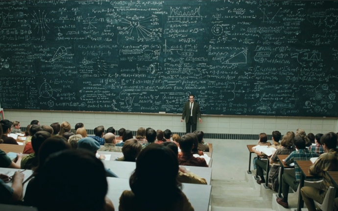

# Esto es un título de primer nivel

## 1. Esto es un título de segundo nivel


## 2. Formateo de texto

Esto es texo normal  

**Esto se mostrará en negrita**

*Esto se mostrará en cursiva*

~~Esto se mostrará tachado~~

> Esto se mostrará como una cita

## 3. Listas

Listas con números:

  1. Primero
  2. Segundo
  3. Tercero


Listas con bullets:

  - Primero
  - segundo
  - Tercero

Mas listas:

  1. Primero
    - 1.1
    - 1.2
  2. Segundo
    - a
    - b
  3. Tercero


### Sub-indices y ..

Un superíndice: Y^2^

Un subíndice:  Y~2~


### Imágenes

Para mostrar una imágen basta con:  

También podríamos haberlo hecho así (da un poco más flexibilidad):


```{r echo = FALSE, comment = "",  out.width = '50%', fig.align = 'center'}
knitr::include_graphics( c("./imagenes/img1.jpeg") )
```

### Formulas

Las formulas hay que escribirlas en Latex. Yo no sé mucho Latex, pero hay editores que facilitan mucho el trabajo: preguntad al profe!!

Una fórmula dentro del texto se escribiría así: $E = mc^{2}$ ; es decir, enmarcándola por `$`

Si quieres la formula ella sola hay que poner dos `$$`:
 
$$E = mc^{2}$$


### Hyperlinks


Esto es un hyperlink: <http://www.wikipedia.es>

Pero es mejor ponerlo así: [enlace a la Wikipedia](http://www.wikipedia.es)


### Notas al pie de página

Para poner notas al pie has de poner [^1] 

[^1]: esto es una nota al pie.


### Tablas

Habrá un tutorial especifico para tablas, pero lo más básico y sencillo es con la función `kable()`:

```{r}
knitr::kable(summary(iris))
```


## 5. Aún más cosas

Hay más cosas, como referencias bibliográficas, pero ya será para el segundo curso de R.

A pesar de que Markdown permite formatear el texto, en ciertos sentidos es limitado; pero si quieres aún más flexibilidad en el output, tendrás que aprender html y mejor html+CSS.

Algunos ejemplos:

1. Si quieres introducir un párrafo en otro color tendrás que hacerlo en html

<FONT COLOR="Red">Esto se mostrará en ROJO!!</FONT>


2. si quieres centrar un párrafo.

<CENTER>Este párrafo irá centrado</CENTER>

3. Una pagina web

<iframe src="http://www.eldiario.es/" height="400" width="800"></iframe>
 
 

4. Un vídeo
 

<iframe width="560" height="315" src="https://www.youtube.com/embed/ACv9zaBa1A4" frameborder="0" allowfullscreen></iframe>
